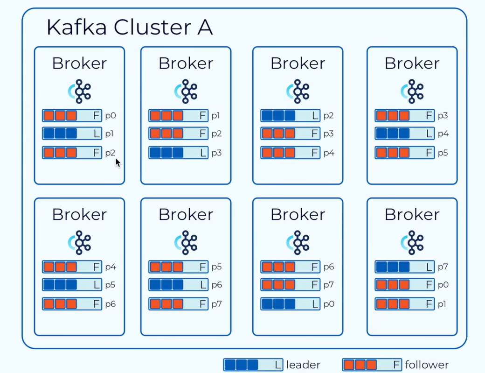

# Kafka
一个分布式的消息处理工具

## 优点
吞吐量高、性能好 \
伸缩性好、支持在线水平拓展 \
容错性和可靠性 \
与大数据生态紧密结合、可无缝对接hadoop、strom、spark等

## 常见的消息模型
### JMS规范
### AMQP
### 结构
* 主题 - 分区(存储在多个机器上) - 
* 消息(键值对存储) 相同 key 的消息会被存储到相同分区
* 副本 kafka会选择一个副本作为 Leader 
数据的 读写 都是从 Leader 进行操作 
* 消息代理 \
Broker
每个服务器上启动一个 Broker 消息代理
负责将 **读写** 的数据写入到磁盘中。

# 一、进度追踪
## 01 操作系统进阶
- [X] 网络原理、网络配置、VMWare 虚拟机的使用
- [X] Linux 安装和使用、Linux 常用命令
- [X] Linux 常用软件安装、JDK、Tomcat
- [ ] Nginx 负责均衡

## 02 数据库
- [ ] Oracle 的安装和使用
- [ ] 数据基础查询、多表查询、子查询
- [ ] 数据库常用函数的使用
- [ ] 数据库 PL SQL编程
- [ ] 数据库索引的使用、事务的使用、数据库设计
- [ ] 数据库用户管理、数据库管理和维护
- [ ] 数据库项目的设计和实现
## 03 JavaSE
- [x] Java 基础:变量、数据类型、流程控制、数组
- [x] 面向对象:类、属性、方法、封装、继承、多态、接口等
- [ ] JDK 常用工具类、集合、
- [ ] 流、集合的源码解读4.多线程、悲观锁、乐观锁
- [ ] 网络编程、Socket
- [ ] JUC 并发编程、常用并发集合及源码解读
- [ ] 反射、注解的使用
- [ ] JDK8 的新特性
- [ ] Java 操作数据库、SQL优化
- [ ] Java 强化:内存管理、GC算法、类加载机制、四种引用
- [ ] 基于Java SE 和 Oracle 的项目设计和实现

## 04 Web

- [ ] 前端编程基础:Html5、css、JavaScript
- [x] maven、git 的使用
- [X] servlet 开发环境搭建
- [ ] http 协议、请求和响应
- [ ] 九大内置对象、四大作用域
- [ ] 过滤器和监听器
- [ ] MVC 思想
- [ ] Web 项目的设计和实现

## 05 框架
- [X] mybatis 持久层框架的使用及源码解读
- [ ] spring 服务层框架的使用及原理
- [ ] springmvc web 层框架的使用、常用注解、工作流程
- [ ] ssm 的整合和应用
- [ ] redis 的搭建和使用、命令、ssm 框架整合
- [ ] springboot 的搭建和使用以及原理
- [ ] restful 接口设计
- [ ] vue 入门、脚手架的使用
- [ ] 前后端分离开发的环境搭建和应用

## 06 框架项目
- [ ] 项目需求分析:根据每个学生想做的项目
老师一对一指导
- [ ] 指导学生画业务流程图，模拟真实的生产环境
- [ ] 指导学生搭建开发环境和编码工作
完成每个功能设计
- [ ] 学生对自己完成的作品进行部署项目上线、调试
- [ ] 指导学生制作产品说明书以及进行产品说明的讲解

## 07 微服务-拓展
- [ ] Springcloud Alibaba nacos 注册中心
- [ ] Springcloud Alibaba Ribbon 负载均衡
- [ ] Springcloud Alibaba Feign 客户端
- [ ] Springcloud Alibaba nacos 配置中心
- [ ] Springcloud Alibaba Sentinel分布式高可用组件
- [ ] Springcloud Alibaba Gateway 网关
- [ ] RabbitMQ 消息队列

## 08 分布式应用
- [ ] 企业级解决方案、更多的生产环境的案例
讲解和分享 
- [ ] 让学生进入企业后能够快速进入工作状态 
适应企业工作环境

## 09 AI大模型
- [ ] 什么是 A1大模型、常见的 Al大模型(GPT、Llama、Qwen 等
- [ ] 自然语言处理的基本概念、常见的 NLP 任务、语言建模、机器翻译、情感分析等
- [ ] 访问预训练 A1 模型的 API(如通译千问的 API)
- [ ] SpringBoot 集成 AI模型 API，实现智能对话功能
- [ ] 部署自定义 A1 模型，使用 SpringBoot 创建 AI模型服务模型推理接口设计与实现
- [ ] 项目:基于 SpringAlibabaAl和阿里云灵积模型服务开发智能客服系统

# 二、学习资源地址
**Servlet** \
视频 
https://www.bilibili.com/video/BV1bC4y147gv \
源码 
https://github.com/yan-fanyu/Servlet

**SpringBoot** \
视频 
https://www.bilibili.com/video/BV1fmvkeeEth \
源码 
https://github.com/yan-fanyu/SpringBoot

**Redis** \
windows安装包
https://github.com/tporadowski/redis/releases/download/v5.0.14.1/Redis-x64-5.0.14.1.msi \
视频 
https://www.bilibili.com/video/BV1c4xbeuEs6 \
源码
https://github.com/yan-fanyu/Redis

**Kafka** \
视频 https://www.bilibili.com/video/BV1h94y1Q7Xg \
源码 https://github.com/yan-fanyu/Kafka
